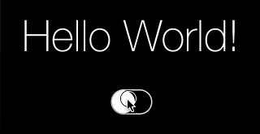

UIView+Shimmer
==============

UIView+Shimmer is a super-lightweight category that adds a shimmering effect to any UIView, without the need for wrappers, nor layout and touch-handling voodoo.



To make any `UILabel` shimmer:

```objc
[label startShimmering];
```

And to make it stop:

```objc
[label stopShimmering];
```

## Installation

Install via [Cocoapods](http://cocoapods.org/). Here's a sample `Podfile`:

    pod 'UIView+Shimmer'

Alternatively, just drop the two files (`UIView+Shimmer.m` and `UIView+Shimmer.h`) into your project tree.

## Contact

Vikram Kriplaney

- http://github.com/markiv
- http://twitter.com/krips
- vikram@local.ch | vikram@iphonso.com

## License

UIView+Shimmer is available under the MIT license. See the LICENSE file for more info.
